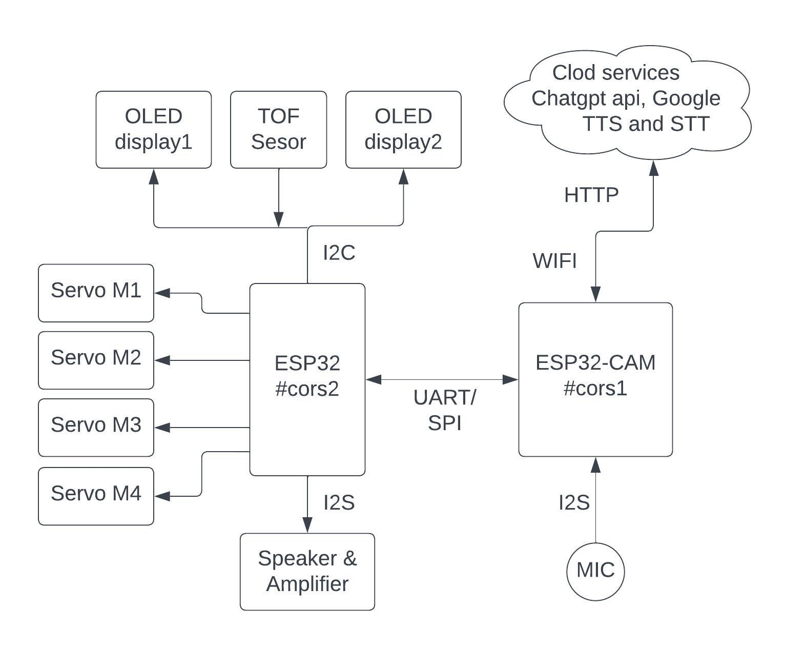

# intellimate - Small Robot with AI Enhancements for Human Assistance

This project aims to enhance the capabilities of a small robot with legs control using servo motors, OLED displays as eyes to react differently and display informations to the user, a speaker for react to the user as a sound or speak with user, Time Of Flight sensors for distance measurements and walk on a table without falling down, camera for object identification, and a microphone for voice input for the various tasks. The enhanced robot will be capable of assisting humans in various tasks using AI technologies such as a voice assistant for control smart home. 

## Functions of the intellimate.
1.  **Object Recognition and Interaction:** The robot uses its camera and TOF sensors to recognize and interact with objects on the table, allowing it to perform tasks.
    
2.  **Stable Tabletop Mobility:** Equipped with TOF sensors in its legs, the robot moves and navigates the table confidently without falling, ensuring stable mobility and preventing accidents.
    
3.  **Intuitive OLED Display Eyes:** The two OLED displays serve as expressive eyes, conveying emotions and information to users in an engaging and relatable manner.
    
4.  **Personalized Face Detection:** The camera identifies faces and greets each individual by name, creating a personalized and welcoming interaction for users and visitors. (Next step)
    
5.  **Voice-Activated Conversations:** The built-in microphone captures voice commands, enabling natural and interactive conversations with the robot for tasks, queries, and even companionship.
    
7.  **AI-Driven Responses:** Utilizing the power of Chat GPT, the robot can provide insightful and comprehensive answers to user queries, enhancing its role as an information resource.
    
9.  **Home Automation Integration:** Seamlessly connects with smart home devices, allowing users to control lights, appliances, and other compatible devices using voice commands.
    
10.  **Assistance and Convenience:** Performs various tasks, such as setting reminders, providing weather updates, and even assisting with shopping lists, enhancing daily efficiency.
***
**Functions that I implement for the semester project.**
 1. Walking on the table (don't use TOF sensors in this stage).
 2. Follow some voice commands. (Ex. Control a smart bulb)
 3. Answering human voice questions using Chatgpt api via speaker.
 4. When someone who is not in front of intellimate speaks, intellimate turns and tries to find him using object detection techniques.
 5. Bit of eye reactions implement on the oled displays.

 ***
**There are 6 main steps in the development process.**
1. Select components and develop the main hardware structure.
2. Develop robot movements, eye reactions and how use tof sensors. 
3. Research and develop image recognition on locally (esp32 camera).
4. Research and develop voice recognition.
5. Combine them all in sync and manage communications.

***
## 1. Select components & develop the main hardware  structure

   In this step select sensors, actuators, development board and other circuits for the pet_robot by considering their diamentions and compatibility with my application. Next start 3D designing parts using solidworks.
   
   
   
**Select components**

 - **Development boards** - When the intellimate walk on the table, he has to perform multiple tasks in parallel, such as detecting objects on the table and taking readings from TOF sensors to take the idea of the environment. 
 So I select esp32-cam and esp32 development boards. The esp32-cam module has esp32s chip which is single core chip. But the esp32 have two cores. So I can handle these tasks optimally using these 3 cores. 
 I use SPI communication protocol to communicate with each other.
 
   
   
 - **Servo motors** - use MG90S micro servos for bottom end bend. Because it
   should handle whole weight of the robot. Also use SG90 servo motors
   for other two ends.
   
 - **Display** -  Two i2c different hardware addressed 128*64 oled displays using one I2C lines.
 
 - **Distance Sensors** - Ultrasonic distance sensors size is very large. So
   it is not suitable for this. So I use time of flight sensors for this
   application which is only 3cm*2cm dimentions.
    
    
   
 - **Speakers** - I2S Audio Amplifier with a small size speaker.
 
 - **Microphone** -  INMP441 MEMS  Microphone Module I2S
 
   

 - **Power** - In this stage not focus on batteries. Mainly need two voltages. 3.3v for esp32 boards and 5v for servo motors.  Use a power module which can step down voltage into 3.3v and 5v.

   
**Design parts for 3D printing**

   Mainly I have design head, body, legs, foot and other small supporting parts using solidworks 2019.
   
 - head- I design head part for assemble power distribution circuit and display.    
 
 - Body - In this part include development board, two servo motors to
   control legs, speaker, tof sensors and batteries.
   
 - legs- There are two legs. I include servo motors in this leg for foot control.
 
 - foot- In the foot, there are two time of flight sensors in each feet.

***

## 2.  Develop robot movements, eye reactions and how use tof sensors. 
There are 4 servo motors to take robot movements. There is a library which is match to intellimate robot movements. So we can directly use that library for develop robot movements further more.

Use two 128*64 i2c oled displays to design eye reactions. When we use two oled displays, both of have same hardware address. So we need to change hardware address by changing backside resistor. Finally can controll two oled displays using one i2c line.

Instead of the camera, use time of flight sensors to get some idea of the environment. We use four [time of flight sensors](https://www.st.com/en/imaging-and-photonics-solutions/time-of-flight-sensors.html) to detect objects around the robot and four tof sensors (two per foot each) to detect the edges of the living table. We can't use same addressed TOF sensors in same I2C bus. Because I2C protocol use hardware address of each device. So the solution is to use an I2C 1 to 8 multiplexer for connect 8 tof sensors together.

In the final project we use two i2c buses in the same ESP32 board. Because any pins in esp32 board has I2C capabilities. Only thing is configure that in the code.
***
## 3. Research and develop image recognition on locally.
There is a version of tensorflow which is called tensorflow lite. TensorFlow Lite is a set of tools that enables on-device machine learning by helping developers run their models on mobile, embedded, and edge devices. Also there is a online tool called [Edge Impulse](https://studio.edgeimpulse.com/studio/270549) for create own light-weight models for embedded systems.

 

 1. Install tensorflow to the PC - [Clickhere](https://www.tensorflow.org/install/pip#windows-native)
 
 3. Get models for TensorFlow Lite
You don't have to build a TensorFlow Lite model to start using machine learning on mobile or edge devices. Many already-built and optimized models are available for you to use right away in your application. You can start with using pre-trained models in TensorFlow Lite and move up to building custom models over time, as follows:
	+ Start developing machine learning features with already  [trained models.](https://www.tensorflow.org/lite/models/trained)
	+ Modify existing TensorFlow Lite models using tools such as  [Model Maker](https://www.tensorflow.org/lite/models/modify/model_maker).
	+ Build a  [custom model](https://www.tensorflow.org/tutorials/customization/custom_training_walkthrough)  with TensorFlow tools and then  [convert](https://www.tensorflow.org/lite/models/convert)  it to TensorFlow Lite.
4. TensorFlow Lite with microcontrollers using google Colab. [Tutorial ](https://blog.tensorflow.org/2019/11/how-to-get-started-with-machine.html)

**My Example: Test ML model for pen detection on esp32 ai thinker cam module.**

This model trained using 36 sample pen photos. Then exported as a arduino library and directly used on esp32. This example done by without using tensorflow and google colab. Trained ML classifier on locally. [All Steps. ](https://eloquentarduino.com/esp32-cam-image-recognition/https://eloquentarduino.com/esp32-cam-image-recognition/)

Steps:
1.  collect images from Esp32-cam to create a dataset
2.  train a Machine Learning classifier on your PC to classify images
3.  deploy that classifier to your Esp32-cam

<video width="500px" height="500px" controls="controls"><source src="pictures/pen_detect.mp4" type="video/mp4" /></video>

***

## 4. Research and develop voice recognition.

**Audio Data Communication in a Digital System.**

Digital systems and its audio data requirements within embedded products have dramatically changed. In order for these devices to communicate audio data with each other a standard protocol is required. One such is I2S protocol. It is a serial bus interface, designed by Philip Semiconductor in February 1986 for digital audio interface between the devices. This article discusses an overview of **[I2S protocol](https://docs.espressif.com/projects/esp-idf/en/latest/esp32/api-reference/peripherals/i2s.html)** its working with applications.

**I2S protocol**

The protocol which is used to transmit digital audio data from one device to another device is known as I2S or Inter-IC Sound protocol. This protocol transmits PCM (pulse-code modulated) audio data from one IC to another within an electronic device. I2S plays a key role in transmitting audio files which are pre-recorded from an MCU to a DAC or amplifier. This protocol can also be utilized to digitize audio using a microphone.

The  **I2S protocol features**  include the following.

-   It has 8 to 32 data bits for each sample.
-   Tx & Rx FIFO interrupts.
-   It supports DMA.
-   16-bit, 32-bit, 48-bit, or 64-bit word select period.
-   Simultaneous bi-directional audio streaming.
-   8-bit, 16-bit, and 24-bit sample width.
-   It has different sample rates.
-   The data rate is up to 96 kHz through the 64-bit word select period.
-   Interleaved stereo FIFOs or Independent right & left channel FIFOs

An I2S bus that communicates in standard or TDM mode consists of the following lines:

-   **MCLK:**  Master clock line. It is an optional signal depending on the slave side, mainly used for offering a reference clock to the I2S slave device.
    
-   **BCLK:**  Bit clock line. The bit clock for data line.
    
-   **WS:**  Word (Slot) select line. It is usually used to identify the vocal tract except PDM mode.
    
-   **DIN/DOUT:**  Serial data input/output line. Data will loopback internally if DIN and DOUT are set to a same GPIO. 

An I2S bus that communicates in PDM mode consists of the following lines:

-   **CLK:**  PDM clock line.
    
-   **DIN/DOUT:**  Serial data input/output line.

We use MAX98357A amplifier for communication between esp32 and speaker. Also use INMP441 MEMS Microphone Module to take voice input via I2S protocol.

                       
