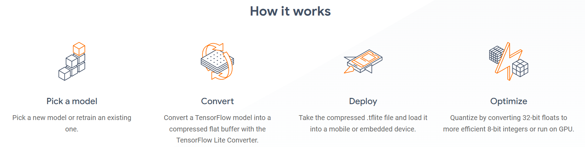

# intellimate - Small Robot with AI Enhancements for Human Assistance

This project aims to enhance the capabilities of a small robot with legs control using servo motors, OLED displays as eyes to react differently and display informations to the user, a speaker for react to the user as a sound or speak with user, TOF sensors for distance measurements and walk on a table without falling down, camera for object identification, and a microphone for voice input for the various tasks. The enhanced robot will be capable of assisting humans in various tasks using AI technologies such as a voice assistant for control smart home. 

## Functions of the pet_robot.
1.  **Object Recognition and Interaction:** The robot uses its camera and TOF sensors to recognize and interact with objects on the table, allowing it to perform tasks.
    
2.  **Stable Tabletop Mobility:** Equipped with TOF sensors in its legs, the robot moves and navigates the table confidently without falling, ensuring stable mobility and preventing accidents.
    
3.  **Intuitive OLED Display Eyes:** The two OLED displays serve as expressive eyes, conveying emotions and information to users in an engaging and relatable manner.
    
4.  **Personalized Face Detection:** The camera identifies faces and greets each individual by name, creating a personalized and welcoming interaction for users and visitors.
    
5.  **Voice-Activated Conversations:** The built-in microphone captures voice commands, enabling natural and interactive conversations with the robot for tasks, queries, and even companionship.
    
6.  **Dynamic Object Reaction:** Each identified object triggers a specific reaction from the robot, allowing it to respond differently based on the recognized item, enhancing engagement.
    
7.  **AI-Driven Responses:** Utilizing the power of Chat GPT, the robot can provide insightful and comprehensive answers to user queries, enhancing its role as an information resource.

    
9.  **Home Automation Integration:** Seamlessly connects with smart home devices, allowing users to control lights, appliances, and other compatible devices using voice commands.
    
10.  **Assistance and Convenience:** Performs various tasks, such as setting reminders, providing weather updates, and even assisting with shopping lists, enhancing daily efficiency.

There are 6 main steps in the development process.
1. Develop the main hardware structure.
2. Develop robot movements, eye reactions and how use tof sensors. 
3. Research and develop image recognition on locally.
4. Research and develop voice recognition.
5. Combine image and voice recognition on esp32-s3-eye and test.
6. Combine them all in sync.

## 1. Develop the main hardware structure

   In this step select sensors, actuators, development board and other circuits for the pet_robot by considering their diamentions and compatibility with my application. Next start 3D designing parts using solidworks.
   

**Select components**
   
 - Development board - I have limited space in the robot body for mount
   whole sensors motors and othr circuits. So I use ESP32-S3-EYE board.
   Because it have inbuilt microphone, camera module and display output.
   Then I no need to manage these things using external bundle of
   circuits. Also ESP32-S3-EYE have two co-processors, It is based on
   the ESP32-S3 SoC and ESP-WHO, Espressif’s AI development frameworks.
   Using each high speed co-processors I can manage robot motions,
   reactions and AI part smoothly.
   
 - Servo motors - use MG90S micro servos for bottom end bend. Because it
   should handle whole weight of the robot. Also use SG90 servo motors
   for other two ends.
   
 - Display - Now I use two i2c different hardware addressed 128*64 oled displays.
 
 - Distance Sensors - Ultrasonic distance sensors size is very large. So
   it is not suitable for this. So i use time of flight sensors for this
   application which is only 3cm*2cm dimentions.
   
 - Speakers - use speaker amplifire with small type speaker.

   

**Design parts for 3D printing**

   Mainly I have design head, body, legs, foot and other small supporting parts using solidworks 2019.
   
 - head- I design head part for assemble power distribution circuit and display.    
 
 - Body - In this part include development board, two servo motors to
   control legs, speaker, tof sensors and batteries.
   
 - legs- There are two legs. I include servo motors in this leg for foot control.
 
 - foot- In the foot, there are two time of flight sensors in each feet.

## 2.  Develop robot movements, eye reactions and how   		use tof sensors. 
There is a library which is match to intellimate robot movements. So we can directly use that library for develop robot movements further more.

Use two 128*64 i2c oled displays to design eye reactions. When we use two oled displays, both of have same hardware address. So we need to change hardware address by changing backside resistor. Finally can controll two oled displays using one i2c line.

Instead of the camera, use time of flight sensors to get some idea of the environment. We use four [time of flight sensors](https://www.st.com/en/imaging-and-photonics-solutions/time-of-flight-sensors.html) to detect objects around the robot and four tof sensors (two per foot each) to detect the edges of the living table. 

## 3. Research and develop image recognition on locally.
There is a version of tensorflow which is called tensorflow lite. TensorFlow Lite is a set of tools that enables on-device machine learning by helping developers run their models on mobile, embedded, and edge devices. Also there is a online tool called [Edge Impulse](https://studio.edgeimpulse.com/studio/270549) for create own light-weight models for embedded systems.

 

 1. Install tensorflow to the PC - [Clickhere](https://www.tensorflow.org/install/pip#windows-native)
 
 3. Get models for TensorFlow Lite
You don't have to build a TensorFlow Lite model to start using machine learning on mobile or edge devices. Many already-built and optimized models are available for you to use right away in your application. You can start with using pre-trained models in TensorFlow Lite and move up to building custom models over time, as follows:
	+ Start developing machine learning features with already  [trained models.](https://www.tensorflow.org/lite/models/trained)
	+ Modify existing TensorFlow Lite models using tools such as  [Model Maker](https://www.tensorflow.org/lite/models/modify/model_maker).
	+ Build a  [custom model](https://www.tensorflow.org/tutorials/customization/custom_training_walkthrough)  with TensorFlow tools and then  [convert](https://www.tensorflow.org/lite/models/convert)  it to TensorFlow Lite.
4. TensorFlow Lite with microcontrollers. [Tutorial ](https://blog.tensorflow.org/2019/11/how-to-get-started-with-machine.html)

   
                       
